# 32-bit-Cpu

## 1. Introduction
This repository contains the implementation of a simple 32-bit single-cycle CPU in Verilog. It supports a custom-designed instruction set and includes fundamental components like an ALU, control unit, register file, and memory modules.

## 2. High Level Architecture
<figure style="display: inline-block; text-align: center;">
  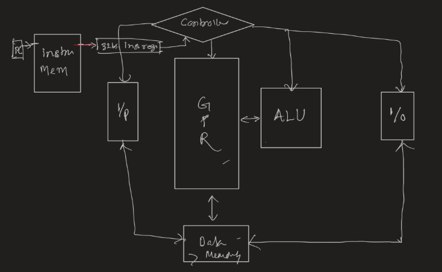
  <figcaption>Fig 2.1: Rough hand-drawn diagram of microarchitecture.</figcaption>
</figure>

A conceptual overview of the CPU architecture, including major components and data/control flow, at a high level.
Here, we will have 16 GPRs. Instruction memory and Data memory are made up of 64 32-bit blocks.

## 3. System Block
<figure style="display: inline-block; text-align: center;">
  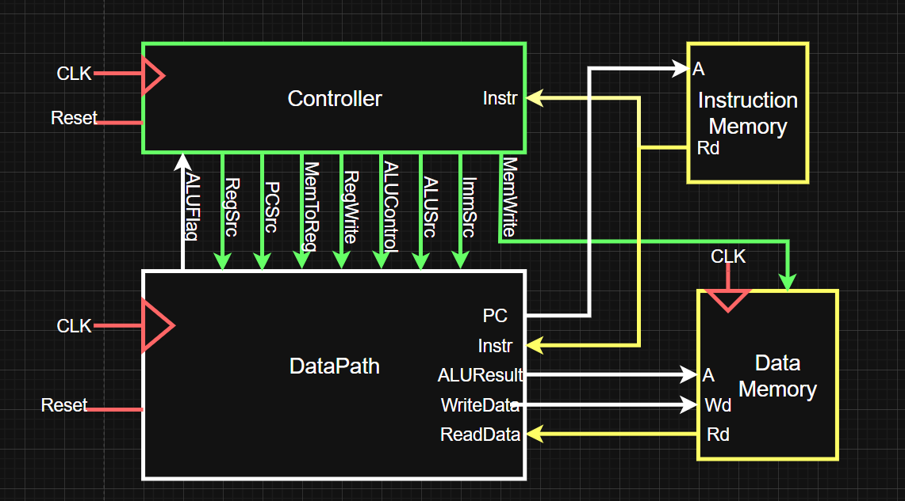
  <figcaption>Fig 3.1: High-level block diagram with Datapath, Control Unit, Instruction Memory, and Data Memory.</figcaption>
</figure>

High-level component interaction and data/control signal paths. This is the top level view of our entire system (shown in highest level of abstarction).

## 4. Datapath Details
<figure style="display: inline-block; text-align: center;">
  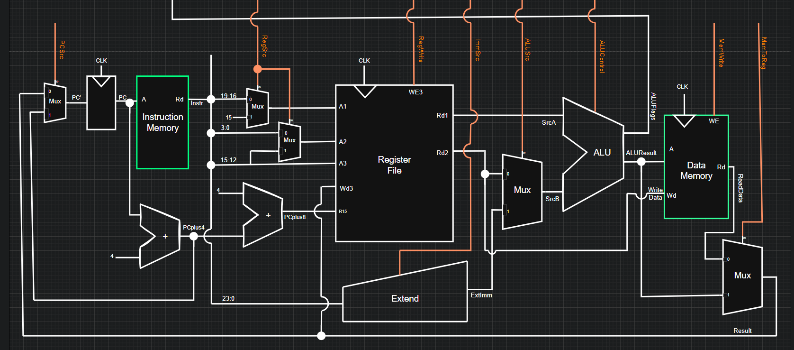
  <figcaption>Fig 4.1: Schematic of internal structure of Datapath block along with Memory Blocks.</figcaption>
</figure>

This is the schematic of the internal structure of the Datapath block and shows how registers, ALU, multiplexers, and memory interact within the datapath. Here Memory blocks are shown in green as they are external blocks (not part of the datapath block). Also control signals for the datapath are shown in orange color here.

## 5. Datapath and Control Unit Interface
<figure style="display: inline-block; text-align: center;">
  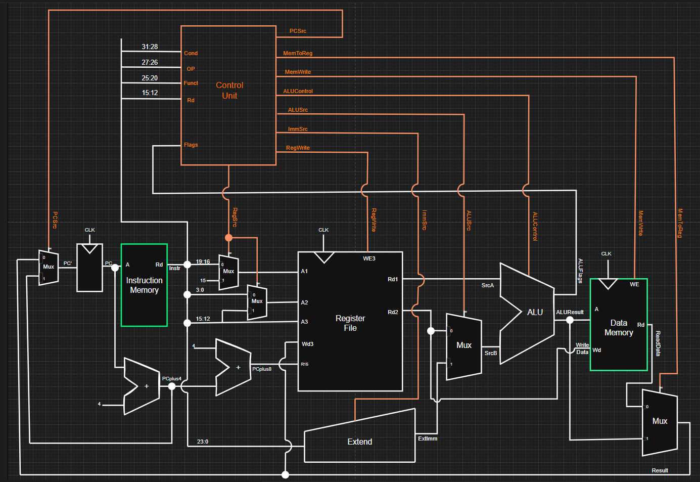
  <figcaption>Fig 5.1: Detailed schematic showing the interconnection of datapath, control unit and memory blocks.</figcaption>
</figure>

This schematic extends the previous datapath schematic to show the entire picture of how Memory blocks, datapath and control units are connected to each other and also illustrates signal flow between control unit outputs (control signals) and datapath components.

## 6. Control Unit Internal Structure
<figure style="display: inline-block; text-align: center;">
  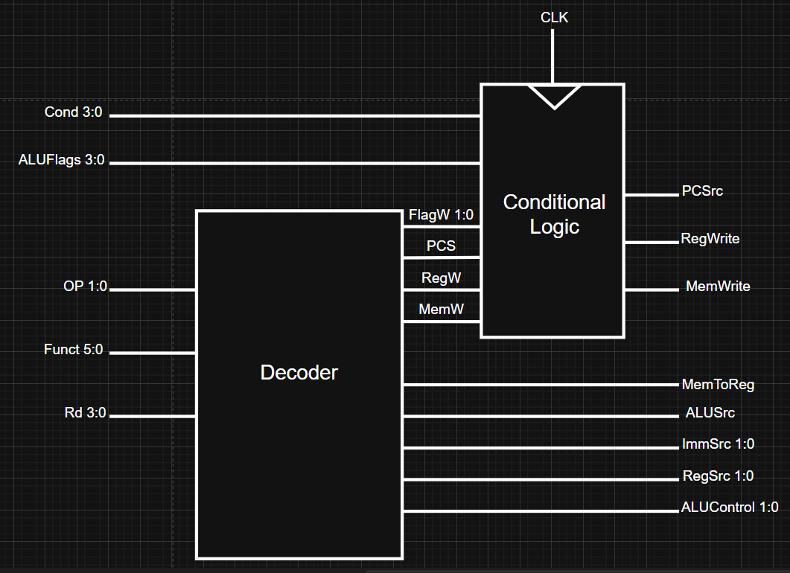
  <figcaption>Fig 6.1: Schematic showing the internal components of Controller (or Control Unit).</figcaption>
</figure>

This Schematic shows that control unit is composed of two parts (or blocks)
	
    - Decoder
	
    - Conditional Logic

From this we can begin to understand the working of controller. We have Decoder which generates all the control signals on decoding the current instruction.

Note : Some control signals need to pass through conditional Logic (as they will only be passed to datapath if in case of conditional instruction condition is satisfied).

## 7. Decoder Block (Inside Control Unit)
<figure style="display: inline-block; text-align: center;">
  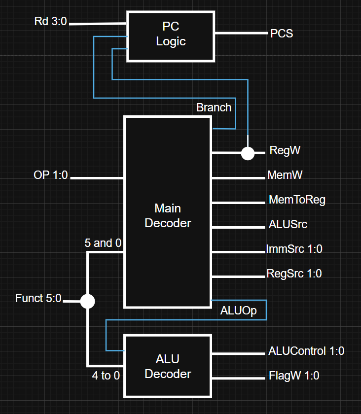
  <figcaption>Fig 7.1: Schematic showing internal components of Decoder block.</figcaption>
</figure>

This Schematic shows that Decoder of control Unit is composed of : 

	- PC Logic

	- Main Decoder

	- ALU Decoder

ALU Decoder generates the ALUControl signals to drive ALU in datapath. It also generates FlagW (2-bit) signal (to be used by Conditional logic) which is used to define if only N, Z flags can be set, or C, V Flags can be set or all based on type of instruction (ex. Logical instruction will only set N, Z flags).

PC Logic generates PCS Signal which will select the source of Program Counter. PCS is passed through Conditional Logic first as if the condition of conditional instruction is not met PCS will not pass.

Main Decoder generates all rest control signals. It generates 2 additional signals Branch and ALUOp which are used by PC Logic and ALU Decoder respectively. RegW and MemW signals are first passed through conditional logic before passing to datapath (for just in case conditional instruction has unsatisfied condition).

## 8. Conditional Logic Block (Inside Control Unit)
<figure style="display: inline-block; text-align: center;">
  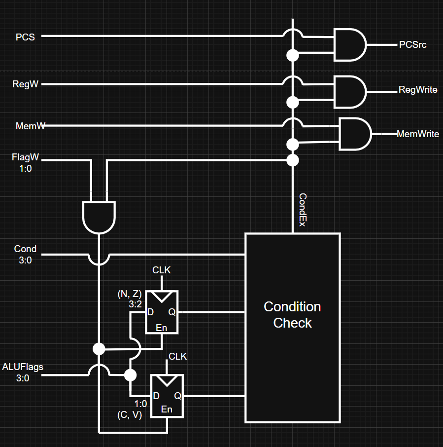
  <figcaption>Fig 8.1: Schematic showing internal components of Conditional Logic.</figcaption>
</figure>

ALUFlags is a 4 bit bus generated by the ALU after doing alu operation for current instruction.
ALUFlags has the N and Z flag for current operation at bit position 3 and 2, C and V flag for current instruction operation at bit position 1 and 0.

Condition Check block takes Cond 4-bit bus as input which contains condition bits of instruction (ex ADDEQ here condition is EQ if satisfied then only ADD will take place). Based on the current condition bit it uses Flag values from the previous clock cycle (or instruction) to check if they satisfy certain boolean expressions (which can be found in the ‘Cond’ Section of Instruction Set part of this documentation). Based on that it sets CondEx as high or Low.

Note : CondEx helps to prevent control signals from passing and Flags being updated if in case of conditional instruction, condition doesn’t satisfy.

If condEx is high we allow PCS, RegW and MemW to pass as it is. Also based on FlagW (2-bit bus where if MSB=1 we can set N, Z Flags and if LSB = 1 we can set C, V Flags) and CondEx we update the Flag values in the Condition check block with Flags generated on executing the current instruction.

## 9. Instruction Set Architecture (ISA)

Our designed CPU supports 32 bit instructions. These instructions are divided into the following 3 categories.

- DataProcessing Instructions : ADD SUB AND ORR

- Memory Instructions : STR and LDR

- Branch Instruction : B

### 9.1 Data Processing Instruction
<figure style="display: inline-block; text-align: center;">
  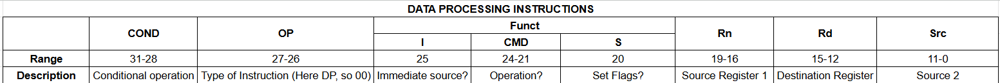
  <figcaption>Fig 9.1.1: Figure showing the structure of data processing type of instructions with bit range.</figcaption>
</figure>

#### Cond
- Bit Range : 31 - 28
- No of Bits : 4
- Description : It is used to implement conditional instruction.

<figure style="display: inline-block; text-align: center;">
  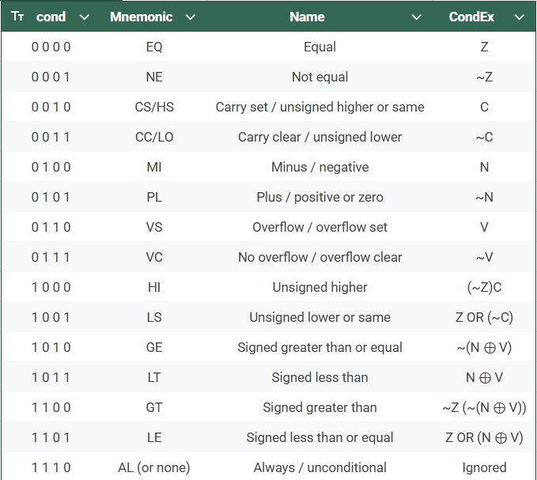
  <figcaption>Fig 9.1.2: Table showing different Cond values and their meaning for our designed CPU.</figcaption>
</figure>

Note : Here N = Flag for Negative, Z = Flag for Zero, C = Flag for carry, V = Flag for overflow

#### OP Code
- Bit Range : 27 - 26
- No of Bits : 2
- Description : Category of Instruction (Here Data Processing so Op = 00).

<figure style="display: inline-block; text-align: center;">
  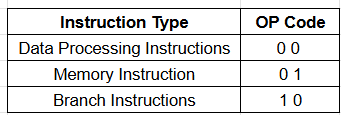
  <figcaption>Fig 9.1.3 : Table showing different values that opcode can have and their meaning.</figcaption>
</figure>

#### Funct
<figure style="display: inline-block; text-align: center;">
  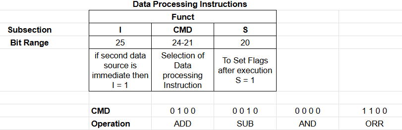
  <figcaption>Fig 9.1.4 : Figure showing the structure of Funct in data processing instructions and different values that can be used in funct and their meaning.</figcaption>
</figure>

#### Rn and Rd
4-bits each used to refer to register for source_1 and destination respectively. As we only have 16 GPRs therefore 4-bits to be able to address each of these.

#### Src
- Bit Range : 11:0
- No of Bits : 12

<figure style="display: inline-block; text-align: center;">
  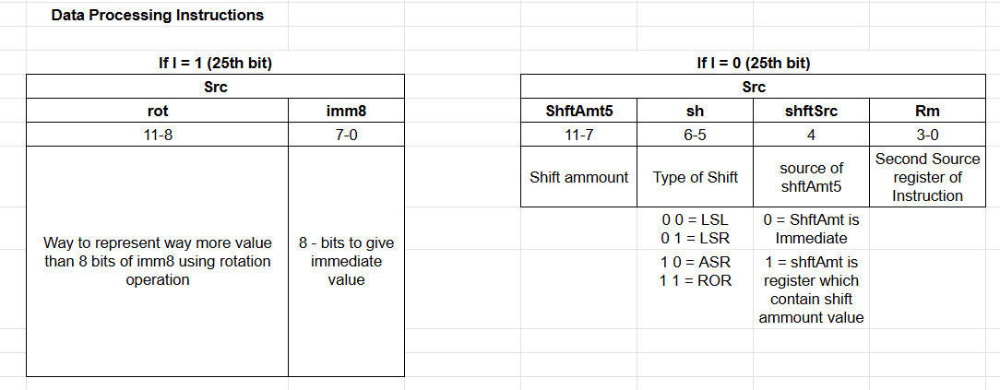
  <figcaption>Fig 9.1.5: Figure showing structure of src depending on the value of immediate bit I.</figcaption>
</figure>

### 9.2 Memory Instructions
Memory instructions have a very similar structure to data processing instructions. Only the Funct portion is different.

<figure style="display: inline-block; text-align: center;">
  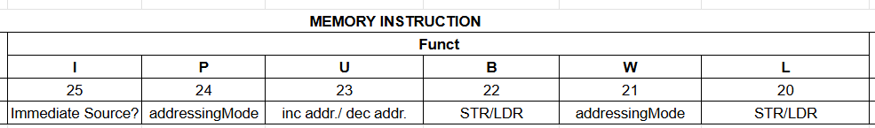
  <figcaption>Fig 9.2.1: Figure showing the structure of the Funct portion of memory instructions.</figcaption>
</figure>

Cond, Op, Rn, Rd, Src are the same as Data processing instructions.

<figure style="display: inline-block; text-align: center;">
  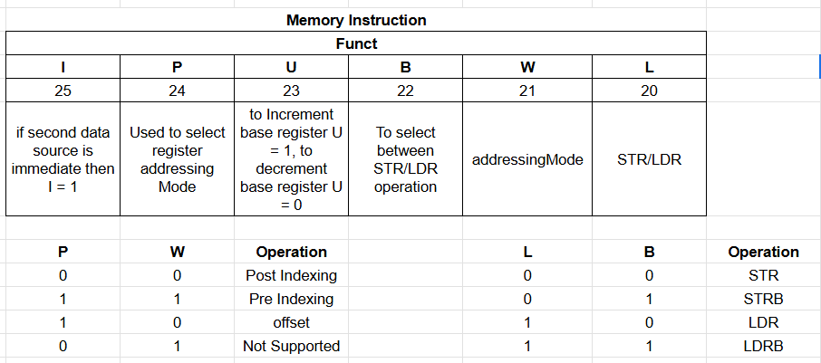
  <figcaption>Fig 9.2.2: Figure showing different values that can be inserted in funct portion of memory instructions.</figcaption>
</figure>

Note : We only support post indexing mode with immediate increment as of now.
Therefore PW = 00 and U=1.

### 9.3 Branch Instruction
<figure style="display: inline-block; text-align: center;">
  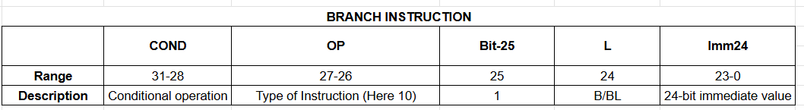
  <figcaption>Fig 9.3.1: Figure showing the structure of Branch type of instructions.</figcaption>
</figure>

In branch instructions Cond, Op part is the same as done previously. The 25th bit is always High.

At 24th position we have L, If this bit is set high we perform branch and link. Currently branch and link operation is not supported, so L=0.

At bit range 23:0 we have 24 bit immediate value. Here we pass the number that tells us how many instructions to move forward or backward. This is a signed number. 
*Address of resulting instruction = (PC + 8) + (imm24 * 4);*

## 10. Testing
To test a CPU working we need to have an extensive code which can examine each and every instruction covered in this CPU design , and then if that code is being executed by our CPU with the required final result we can say that CPU passed the initial test

To test our design, we have taken the reference test Code from Digital Design and Computer Architecture ARM edition by Harris.

| ADDR | PROGRAM                 | COMMENTS                         | BINARY MACHINE CODE                 |
|------|-------------------------|----------------------------------|-------------------------------------|
| 00   | SUB R0, R15, R15        | R0 = 0                           | 1110 000 0010 0 1111 0000 0000 1111 |
| 04   | ADD R2, R0, #5          | R2 = 5                           | 1110 001 0100 0 0000 0010 0000 0101 |
| 08   | ADD R3, R0, #12         | R3 = 12                          | 1110 001 0100 0 0000 0011 0000 1100 |
| 0C   | SUB R7, R3, #9          | R7 = 3                           | 1110 001 0010 0 0011 0111 0000 1001 |
| 10   | ORR R4, R7, R2          | R4 = 3 OR 5 = 7                  | 1110 000 1100 0 0111 0100 0000 0010 |
| 14   | AND R5, R3, R4          | R5 = 12 AND 7 = 4                | 1110 000 0000 0 0011 0101 0000 0100 |
| 18   | ADD R5, R5, R4          | R5 = 4 + 7 = 11                  | 1110 000 0100 0 0101 0101 0000 0100 |
| 1C   | SUBS R8, R5, R7         | R8 = 11 - 3 = 8, set Flags       | 1110 000 0110 1 0101 1000 0000 0111 |
| 20   | BEQ END                 | shouldn't be taken               | 0000 1010 0000 0000 0000 0000 1000  |
| 24   | SUBS R8, R3, R4         | R8 = 12 - 7 = 5                  | 1110 000 0010 1 0011 1000 0000 0100 |
| 28   | BGE AROUND              | should be taken                  | 1010 1010 0000 0000 0000 0000 0010  |
| 2C   | ADD R5, R0, #0          | should be skipped                | 1110 001 0100 0 0000 0101 0000 0000 |
| 30   | AROUND: SUBS R8, R7, R2 | R8 = 3 - 5 = -2, set Flags       | 1110 000 0110 1 0111 1000 0000 0010 |
| 34   | ADDLT R7, R5, #1        | R7 = 11 + 1 = 12                 | 1011 001 0100 0 0101 0111 0000 0001 |
| 38   | SUB R7, R7, R2          | R7 = 12 - 5 = 7                  | 1110 000 0010 0 0111 0111 0000 0010 |
| 3C   | STR R7, [R3, #84]       | mem[12+84] = 7                   | 1110 010 1100 0 0011 0111 0001 0100 |
| 40   | LDR R2, [R0, #96]       | R2 = mem[96] = 7                 | 1110 010 1101 0 0000 0010 0001 1000 |
| 44   | ADD R15, R15, R0        | PC = PC+8 (skips next)           | 1110 000 0100 0 1111 1111 0000 0000 |
| 48   | ADD R2, R0, #14         | shouldn't happen                 | 1110 001 0100 0 0000 0010 0000 1110 |
| 4C   | B END                   | always taken                     | 1110 1010 0000 0000 0000 0000 0010  |
| 50   | ADD R2, R0, #13         | shouldn't happen                 | 1110 001 0100 0 0000 0010 0000 1101 |
| 54   | ADD R2, R0, #10         | shouldn't happen                 | 1110 001 0100 0 0000 0010 0000 1010 |
| 58   | END: STR R2, [R0, #84]  | mem[84] = 7                      | 1110 010 1100 0 0000 0010 0001 0100 |

‘imem.v’ : instruction memory source this codes in hexadecimal format.

testbench.sv : Check if we are getting mem[84]==7 or not, which is the final expected outcome of this test code.

Additionally we can test each block separately in isolation:
aluTest.v : testbench for ALU block

## 11. Assembler Script
To assemble instructions easily, a Python-based assembler (*assembler.py*) is provided.
By using this assembler we can generate the Hex Code of our assembly code.

In order to use this assembler follow the given steps.

**Step 1 :** Write your assembly program and save it in the ‘*assembler/assemblyCodes*’ folder or change the open path in *assembler/hexGenerator.py* file.

**Step 2 :** Run the following command *python3 assembler/hexGenerator.py*

**Step 3 :** Input the name of the assembly file when prompted.

**Step 4 :** You hex code file generated in *assembler/* folder as *program.mem* (This behavior can be modified in *hexGenerator.py*)

**Step 5 :** Copy the path of this newly generated hex file, and paste this path in *$readmemh(<path>, RAM)* inside '*src/inst_memory.v*' file. So that instruction memory can be preloaded with this hex code.

**Step 6 :** Create a test bench and test your newly written program on our cpu.

## 12. Limitations / Future Work
- Shift operations not fully implemented
- Branch with link (BL) is reserved but not functional
- No pipelining or hazard detection
- No interrupt handling
